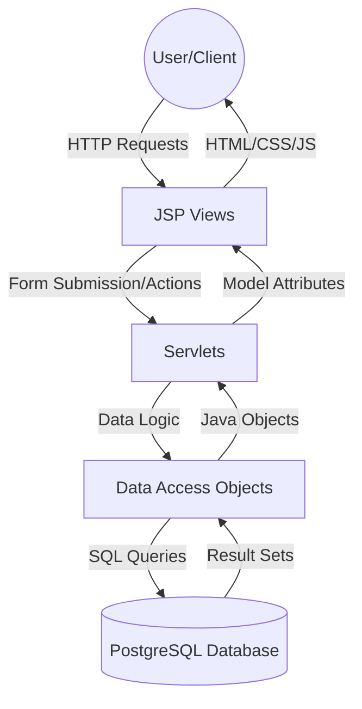
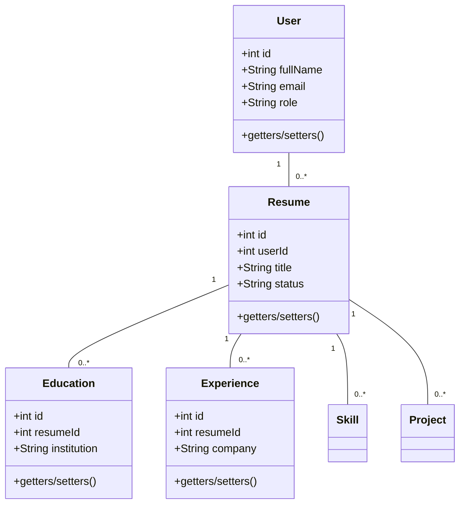
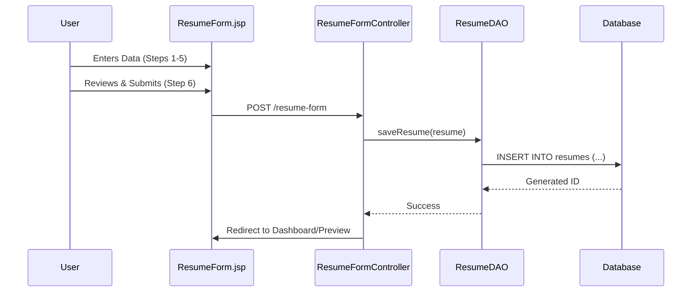
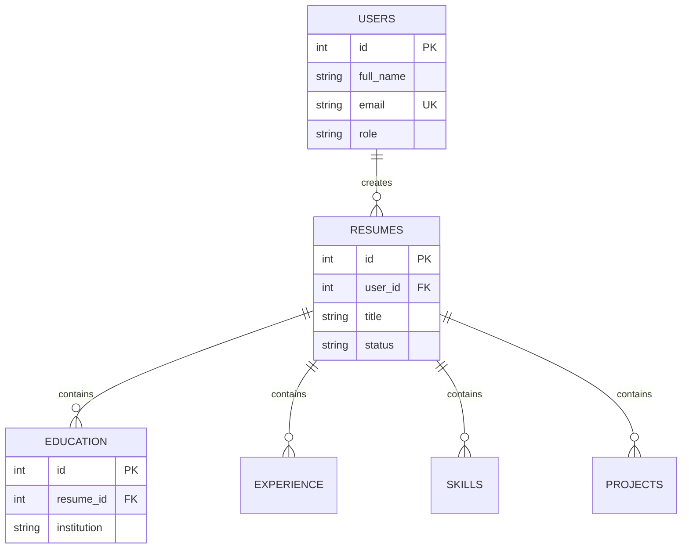

# System Design Document: ResumeForge

## 1. System Architecture (MVC)
ResumeForge follows the **Model-View-Controller (MVC)** architectural pattern to ensure separation of concerns and maintainability.



## 2. Use Case Diagram
Visualizes the interactions between actors and system functionalities.

```mermaid
useCaseDiagram
    actor User
    actor Admin
    actor Manager
    
    package ResumeForge {
        usecase "Login" as UC1
        usecase "Manage Resumes" as UC2
        usecase "Search Dashboard" as UC3
        usecase "Export PDF/DOCX" as UC4
        usecase "Manage Users" as UC5
        usecase "Approve Resumes" as UC6
    }
    
    User --> UC1
    User --> UC2
    User --> UC3
    User --> UC4
    
    Manager --> UC1
    Manager --> UC3
    Manager --> UC6
    
    Admin --> UC1
    Admin --> UC5
    Admin --> UC2
```

## 3. Class Diagram
Key models and their relationships.



## 4. Sequence Diagram (Create Resume)
Illustration of the process flow for creating a new resume.



## 5. Database ER Diagram
Entity-Relationship model for the PostgreSQL schema.


